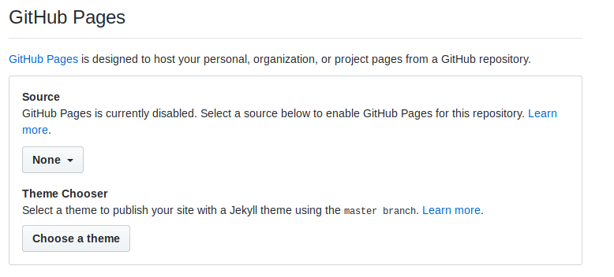

!!! note "TL;DR"

    ```bash
    gith clone https://github.com:pwoolvett/pwoolvett.github.io
    ```


# Motivation

These are instructions for a free (:beer: and speech) webpage, hosted in github pages.

# Instructions


## Create github repo

Create a repo. Go to settings (gear button, top right tab). About ¾ down the page, there's a "Github Pages" section. Select a source: either a full breanch, or a specific folder where docs (static pages in our case) will be located.



For profile pages, this will be automatically enabled and fixed to `master` branch. For project pages, just create beforehand a `gh-pages` branch.

!!! note "Jekyll"
    The intended way is to use jekyll. Just ignore that. We'll use mkdocs, because reasons.

## [OPTIONAL] Setup custom webpage

1. Go to www.freenom.com, register and get a free (:beer:) `.tk`, `.ml`, `.ga`, `.cf`, or `.gq` domain.

2. Point dns to github: After getting your own domain, go to "Manage Freenom DNS" and create A records with `host=@`, pointing to: `185.199.1xx.153`, replacing `xx` with numbers `08`, `09`, `10`, and `11` (four records in total).

## Using mkdocs to create html from markdown

We'll create this folder structure:

```bash
.
├── docker-compose.yml
├── docs
│   ├── CNAME
│   ├── logo.png
│   └── index.md
├── entrypoint.sh
└── mkdocs.yml
```

### `./docker-compose.yml`

``` yaml
version: '3.6'

services:
  mkdocs:
    image: squidfunk/mkdocs-material
    ports:
      - "8000:8000"
    volumes:
      - ./:/docs
      - ~/.ssh:/tmp/.ssh:ro
      - ~/.gitconfig:/root/.gitconfig:ro
      - ./entrypoint.sh:/usr/local/bin/entrypoint:ro
```

!!! note "SSH"
    The last three volumes are only used if you want to use github `ssh` remote. For `https` its not required.

!!! note "master branch"
    If you're using the `master` branch (for your personal page) and want to run `mkdocs gh-deploy` (the "deploy to github" command), also make sure to pass `-b master`.

### `docs/CNAME`

Just an empty text file with the domain you acquired and nothing else, eg:

```bash 
echo mywebsite.gq > docs/CNAME
```

### `docs/index.md`

All the other "source" files can be named `whatever-you-want.md`. Just name the first `index.md` and put whatever markdown makes sense for you.

### `./entrypoint.sh`

Only required if using ssh remote.
This is just a workaround to allow the default docker user to use a previously configured ssh credentials without permission issues:

``` bash
set -e

cp -R /tmp/.ssh /root/.ssh
chmod 700 /root/.ssh
chmod 644 /root/.ssh/id_rsa.pub
chmod 600 /root/.ssh/id_rsa

exec "$@"
```

### `./mkdocs.yml`

```yaml
site_name: <<Your site name here>>
theme:
  name: 'material'
  palette:
    primary: 'white'
    accent: 'indigo'
  logo: '<<Your logo here>>'
  favicon: '<<Your logo here>>'
markdown_extensions:
  - admonition
  - pymdownx.highlight
  - toc:
      permalink: true
  - footnotes
  - pymdownx.arithmatex
  - pymdownx.betterem:
      smart_enable: all
  - pymdownx.caret
  - pymdownx.critic
  - pymdownx.details
  - pymdownx.emoji:
      emoji_generator: !!python/name:pymdownx.emoji.to_svg
  - pymdownx.inlinehilite
  - pymdownx.magiclink
  - pymdownx.mark
  - pymdownx.smartsymbols
  - pymdownx.superfences
  - pymdownx.tasklist:
      custom_checkbox: true
  - pymdownx.tilde
  - meta
extra_javascript:
  - 'https://cdnjs.cloudflare.com/ajax/libs/mathjax/2.7.0/MathJax.js?config=TeX-MML-AM_CHTML'
  - https://cdnjs.cloudflare.com/ajax/libs/highlight.js/10.1.1/highlight.min.js
  # - javascripts/config.js
  - js/termynal.js
  - js/customTermynals.js
extra_css:
  - https://cdnjs.cloudflare.com/ajax/libs/highlight.js/10.1.1/styles/default.min.css
  - css/termynal.css
nav:
  - Home: index.md

```


### other files

get termynal js and css , put them inside `docs/js` and `docs/css`, respectively.

To automatically init termynals, put this in `docs/js/customTermynals.js`:

```js
function initTermynals (){
    document.querySelectorAll('[id^="termynal"]').forEach(
        terminal=>{
            new Termynal(terminal);
        }
    );
}

initTermynals();
```

## [OPTIONAL] Checking before deploying

Although not necessary, you can preview the output you'll get either by running `mkdocs serve`, which serves and auto-reloads the html form your markdown, or `mkdocs build`.

## [OPTIONAL] Push/deploy webpage

When you're happy with your results, run `mkdocs gh-deploy` to push your changes to github. After a short while, your new content will be available in your webpage.


!!! note "Sources"

    * [Github Pages] (https://pages.github.com/)
    * [mkdocs] (https://www.mkdocs.org/)
    * [mkdocs-material] (https://github.com/squidfunk/mkdocs-material)
    * [this very page] (https://github.com/pwoolvett/pwoolvett.github.io)
